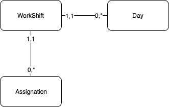

.. WorkShift Engine documentation master file, created by
   sphinx-quickstart on Sun Apr 14 02:27:40 2019.
   You can adapt this file completely to your liking, but it should at least
   contain the root `toctree` directive.

Welcome to WorkShift Engine's documentation!
============================================

Hello!. Thanks for been here and I hope that this package will be usefull for you. Before start using any of these tools you need to understand some strcutures.

In the most of the services we will talk about *"assignation"*. This concept is a Python object that you must provide. The structure should be like:

Assignation Model
-----------------

    * **starting_date:** the date where your assignation starts
    * **ending_date:** the date where your assignation ends
    * **person(FK):** the person realted to this assignation
    * **person_id:** the person_id related to this assignation
    * **workshift(FK):** the workshift related to this assignation
    * **workshift_id:** the workshift_id related to this assignation
    * **start_day:** is an offset, is the number from where the assignation is valid

WorkShift Model
----------------

Also you'll need a *"WorkShift model"* with at least these attributes:

    * **total_workshift_days:** the number of days that a workshift cycle lasts
    * **workshift_type:** the workshift type (weekly, cyclic or manually)

This attribute only will be used when the *"start_day"* attribute has a value(*not None*). Otherwise it must be setted as *None*.

An these methods:

    * **get_days():** Get a list of the days

Day Model
----------------

This model should represent a day structure of an specific workshift. Their attributes shoud be at least:

    * **starting_time:** the time where the person should work that day
    * **ending_time:** the time whefre the person should leave the work that day
    * **day_number:** a string number that represent

So in summary these models must represent an ERM like this:

.. toctree::
   :maxdepth: 1
   :caption: Contents:

   assignation/index
   collision/index
